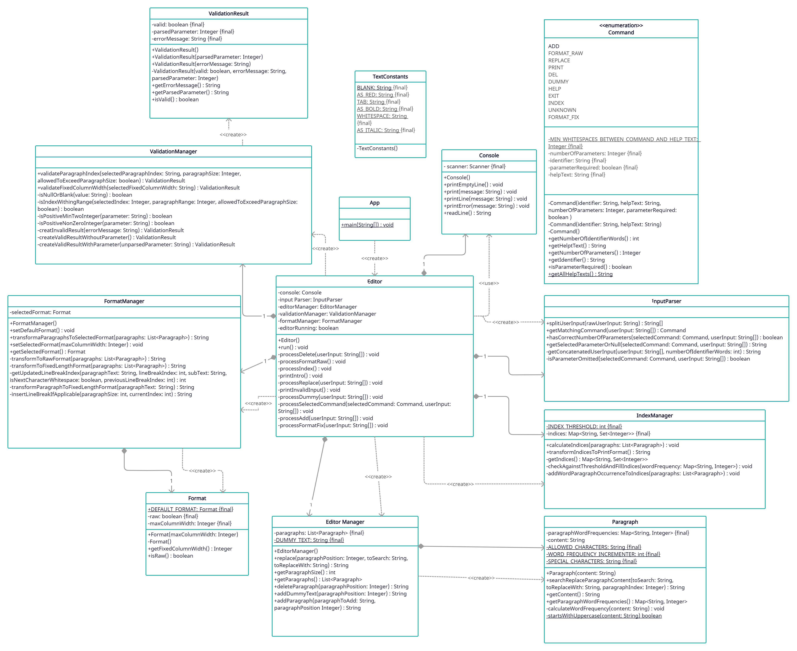

# Text Editor

A simple text editor with input and output via the console.

## Getting started

1. Open the repository in the IntelliJ IDE and navigate to the `App.java` file.
2. Click  `Run` next to the `Current File` option on the toolbar.
3. The program is compiled and started accordingly. After that the [commands](#available-commands) listed below can be
   used in the console.

## Available commands

| Command          | Parameter | Description                                                                                      |
|:-----------------|:----------|:-------------------------------------------------------------------------------------------------|
| ADD _[n]_        | Optional  | Adds a paragraph at position n or at the end if no parameter given.                              |
| DEL _[n]_        | Optional  | Removes a paragraph at position n or the last one if no parameter given.                         |
| DUMMY _[n]_      | Optional  | Adds a dummy paragraph at position n or at the end if no parameter given.                        |
| EXIT             | None      | Exits the program.                                                                               |
| FORMAT FIX _[n]_ | Required  | Changes the output format of the paragraphs to only be n columns wide.                           |
| FORMAT RAW       | None      | Changes the output format to a raw output of the paragraphs.                                     |
| HELP             | None      | Prints the help text.                                                                            |
| INDEX            | None      | Indexes word frequency in paragraphs and prints out frequent words.                              |
| PRINT            | None      | Prints out all Paragraphs in the current format.                                                 |
| REPLACE _[n]_    | Optional  | Replaces a sequence of characters in paragraph n or in the last paragraph if no parameter given. |

## Classdiagram

